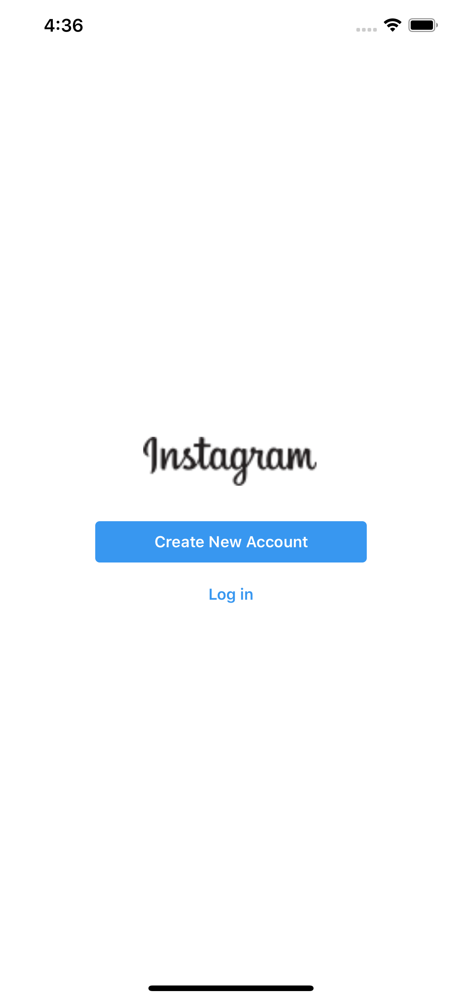

# JJGram iOS & Android App
ReactNative + Hooks + apollo를 활용해 만든 인스타그램 클론 앱

## 실행방법
1. JJGRAM Backend프로젝트를 클론한 후 yarn dev로 서버를 실행시켜줌.
2. jjgram-app 을 git clone해줌
3. clone이 완료되었으면 npm install 명령어 입력
4. yarn start후 프로젝트 사용

## 스크린샷
### 🔒 Auth
로그인(이메일 인증) 및 회원가입(페이스북,이메일,구글)

    
    
    

### 😯 Feed + Post
첫 화면으로 만나는 Feed화면과 검색을 통해 Post를 찾고 상세페이지를 확인하는 것

    
    
    

### 👍 New Post
사진을 선택하거나 촬영하여 새로운 포스트를 올리는 것 

    
    
    

### 🧑‍💻 User Profile
유저의 정보(follower count, following count, post count, post)

    

